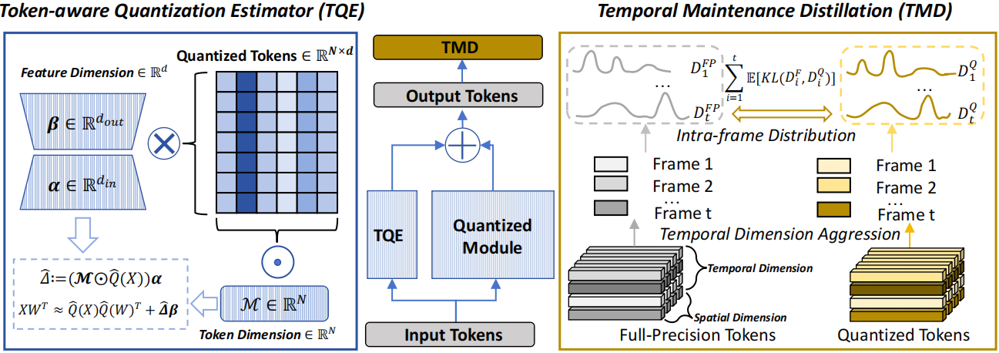
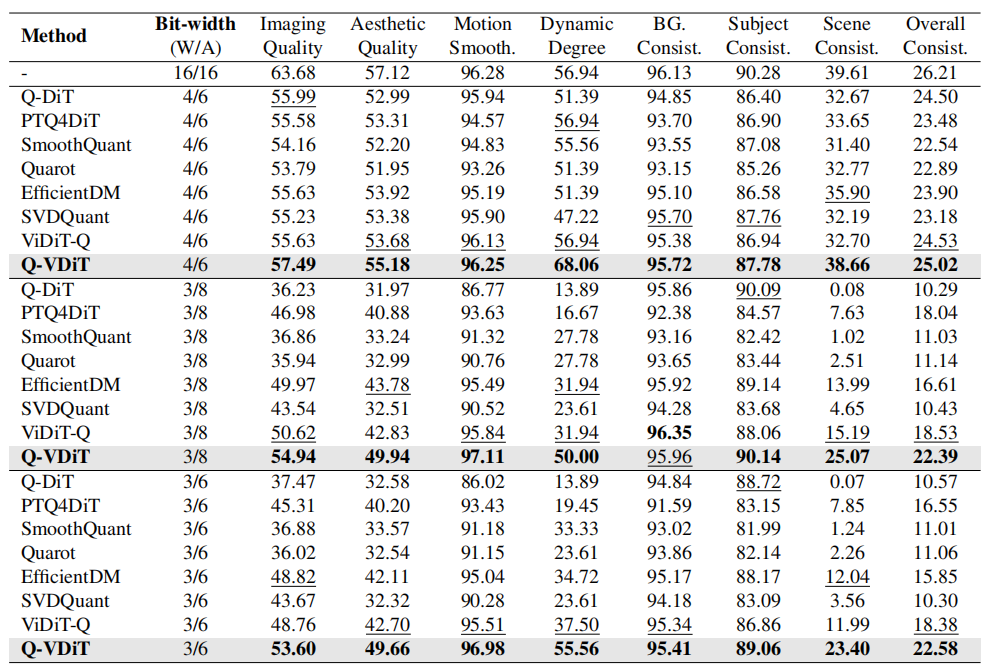

# (ICML 2025) Q-VDiT: Towards Accurate Quantization and Distillation of Video-Generation Diffusion Transformers

[arXiv](https://arxiv.org/abs/2505.22167) | [BibTeX](#bibtex)

------

This project is the official implementation of our "Q-VDiT: Towards Accurate Quantization and Distillation of Video-Generation Diffusion Transformers".



# Env Setup

We recommend using conda for enviornment management. 

```shell 
cd diffuser-dev

# create a virtual env
conda create -n qvdit python=3.10
# activate virtual environment
conda activate qvdit

# the xformers (opensora requires) requires torch version of 2.1.1, newest torch is not compatible
conda install pytorch==2.1.1 torchvision==0.16.1 torchaudio==2.1.1 pytorch-cuda=12.1 -c pytorch -c nvidia  # pip install also works

pip install -r t2v/requirements_opensora.txt

pip install -r t2v/requirements_qdiff.txt

# install flash attention (optional)
pip install packaging ninja
pip install flash-attn --no-build-isolation

# install xformers
pip3 install xformers==0.0.23

# install the qvdit package
# containing our qdiff
pip install -e .

# install opensora
cd t2v
pip install -e .
```

<br>

# Commands to Run

> *After running the following commands, the output (ckpt,generated videos) will appear in the `./logs/`.*

We provide the shell scripts for all process below in `t2v/shell_scripts`.
For example, run `bash t2v/shell_scripts/get_calib_data.sh $GPU_ID` to generate the calibration dataset.


### 1. Download and convert checkpoint of the STDiT (OpenSORA) model

> Please ref [doc of open-sora v1.0](https://github.com/hpcaitech/Open-Sora) for more details, we only support OpenSORA v1.0 for now.

- Download the OpenSora-v1-HQ-16x512x512.pth from [this link](https://huggingface.co/hpcai-tech/Open-Sora/blob/main/OpenSora-v1-HQ-16x512x512.pth)

> the original opensora code merges the qkv linears into a linear layer with more channels, we split it into 3 layers for quantization. 

- Put the downloaded OpenSora-v1-HQ-16x512x512.pth in `./logs/split_ckpt`, and run `t2v/scripts/split_ckpt.py`, the converted checkpoint will appear in `./logs/split_ckpt/OpenSora-v1-HQ-16x512x512-split.pth'`. 

```shell
python t2v/scripts/split_ckpt.py
```

### 2. FP16 inference

- `bash ./t2v/shell_scripts/fp16_inference.sh $GPU_ID`: conducting FP16 inference to generate videos using the 10 opensora example prompt, the video will be saved at `./logs/fp16_inference`. 

> we use the provide the precomputed `text_embeds.pth` in [this link](https://github.com/thu-nics/ViDiT-Q/blob/viditq_old/t2v/utils_files/text_embeds.pth) for 10 opensora example prompts in `t2v/util_files`, which help to avoid loading the t5 ckpts onto GPU (which takes around 1 min, and around 10 GBs of memory) . Please add `--precompute_text_embeds ./t2v/utils_files/text_embeds.pth` when running command.

```shell
CFG="./t2v/configs/opensora/inference/16x512x512.py"  # the opensora config
CKPT_PATH="./logs/split_ckpt/OpenSora-v1-HQ-16x512x512-split.pth"  # your path of splited ckpt
OUTDIR="./logs/fp16_inference"  # your_path_to_save_videos
GPU_ID=$1

CUDA_VISIBLE_DEVICES=$GPU_ID python t2v/scripts/inference.py $CFG --ckpt_path $CKPT_PATH  --outdir $OUTDIR \
--precompute_text_embeds ./t2v/utils_files/text_embeds.pth
```

---

### 3. Generate calib data

- `bash ./t2v/shell_scripts/get_calib_data.sh $GPU_ID`: generating the calibration data (store the activations) at `$CALIB_DATA_DIR/calib_data.pt` for calibration. 

```shell
CFG="./t2v/configs/opensora/inference/16x512x512.py" # the opensora config
CKPT_PATH="./logs/split_ckpt/OpenSora-v1-HQ-16x512x512-split.pth"  # splited ckpt
GPU_ID=$1
CALIB_DATA_DIR="./logs/calib_data"  # the path to save your calib dataset

# quant calib data
CUDA_VISIBLE_DEVICES=$GPU_ID python t2v/scripts/get_calib_data.py $CFG --ckpt_path $CKPT_PATH --data_num 10 --outdir $CALIB_DATA_DIR --save_dir $CALIB_DATA_DIR \
--precompute_text_embeds ./t2v/utils_files/text_embeds.pth
```

### 4. Calibration Process

- `bash ./t2v/shell_scripts/calib.sh $GPU_ID`: conducting the calibration process based on calib data, generate the quantized checkpoint, remember to modify the names for configs and output log:
  - `CFG`: the configuration for opensora inference (we recommend using the same for calib_data generation, calibration, and quant infernece)
  - `CALIB_DATA_DIR`: the path of calibration data
  - `OUTDIR`: the path of outputs, including quantized checkpoint and copied configs

- the `--part_fp` denotes skip the quantization of a few layers (they only account for a negligible amount of computation (<1%)), the arg is defined in `opensora/utils/config_utils.py`, which reads the `part_fp_list` in quant config (default path is `"./t2v/configs/quant/opensora/remain_fp.txt"`). 

```  shell
EXP_NAME="w3a8_ours"

CFG="./t2v/configs/quant/opensora/16x512x512.py"  # the opensora config
Q_CFG="./t2v/configs/quant/opensora/$EXP_NAME.yaml"  # TODO: the config of calibration
CKPT_PATH="./logs/split_ckpt/OpenSora-v1-HQ-16x512x512-split.pth"  # splited ckpt generated by split_ckpt.py
CALIB_DATA_DIR="./logs_100steps/calib_data"  # your path of calib data
OUTDIR="./logs_100steps/$EXP_NAME"  # TODO: your path to save the calibration result
GPU_ID=$1
MP_W_CONFIG="./t2v/configs/quant/opensora/mixed_precision/weight_3_mp.yaml"
MP_A_CONFIG="./t2v/configs/quant/opensora/mixed_precision/act_8_mp.yaml" # the mixed precision config of act
# calibration
CUDA_VISIBLE_DEVICES=$GPU_ID python t2v/scripts/calib.py $CFG --ckpt_path $CKPT_PATH --calib_config $Q_CFG --outdir $OUTDIR \
    --calib_data $CALIB_DATA_DIR/calib_data.pt \
    --part_fp \
    --time_mp_config_weight $MP_W_CONFIG \
    --time_mp_config_act $MP_A_CONFIG \
    --precompute_text_embeds ./t2v/utils_files/text_embeds.pth \

```

### 5. Quantized Model Inference

- `bash ./t2v/shell_scripts/quant_inference.sh $GPU_ID`: conduct the quantized model inference based on the existing quant config and quantized checkpoint (specified by the `OUTDIR`, which is the output path of the calibration process). 

```shell
EXP_NAME='w3a8_ours'

CFG="./t2v/configs/quant/opensora/16x512x512.py" # the opensora config
CKPT_PATH="./logs/split_ckpt/OpenSora-v1-HQ-16x512x512-split.pth"  # your path of splited ckpt
OUTDIR="./logs_100steps/$EXP_NAME"  # your path of the calibration result
GPU_ID=$1
MP_W_CONFIG="./t2v/configs/quant/opensora/mixed_precision/weight_3_mp.yaml"
MP_A_CONFIG="./t2v/configs/quant/opensora/mixed_precision/act_8_mp.yaml" # the mixed precision config of act

# quant inference
CUDA_VISIBLE_DEVICES=$GPU_ID python t2v/scripts/quant_txt2video.py $CFG \
    --outdir $OUTDIR --ckpt_path $CKPT_PATH  \
    --dataset_type opensora \
    --part_fp \
    --time_mp_config_weight $MP_W_CONFIG \
    --time_mp_config_act $MP_A_CONFIG \
    --precompute_text_embeds ./t2v/utils_files/text_embeds.pth \
    --prompt_path t2v/assets/texts/t2v_samples_10.txt \
```

------

## Results



## Comments

- Our codebase is heavily builds on [open-sora v1.0](https://github.com/hpcaitech/Open-Sora) and [ViDiT-Q](https://github.com/thu-nics/ViDiT-Q/tree/viditq_old). Thanks for open-sourcing!

## BibTeX

If you find *Q-VDiT* is useful and helpful to your work, please kindly cite this paper:

```
@article{feng2025q,
  title={Q-VDiT: Towards Accurate Quantization and Distillation of Video-Generation Diffusion Transformers},
  author={Feng, Weilun and Yang, Chuanguang and Qin, Haotong and Li, Xiangqi and Wang, Yu and An, Zhulin and Huang, Libo and Diao, Boyu and Zhao, Zixiang and Xu, Yongjun and others},
  journal={arXiv preprint arXiv:2505.22167},
  year={2025}
}
```

